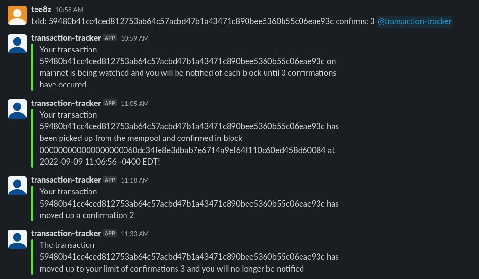

## Bitcoin Transaction Watcher Slack Bot
Slack bot that will watch the bitcoin transactions based on ID
- can watch on mainnet/testnet/signet, will use mainnet as default
- has a dependency on mempool.space to keep track of the transactions and be notified when a new block comes in

##### NOTE:
- If the bot goes down, the state of all transactions being watched will be saved in a .bin file & it will be reloaded on the next successful startup. This data is deleted as the transaction's # of confirmations have passed or 2 weeks have passed since the request occured.

#### How to use in a slack channel:
- bot command options:
    - asking to watch a bitcoin transaction on mainnet for 3 confirmations:
    
    - asking to watch a bitcoin transaction on testnet for 3 confirmations:

    - asking to watch a bitcoin transaction on signet for 3 confirmations:

### Install Binary On Linux
- Create a bot and grab it's SLACK_AUTH_TOKEN & SLACK_APP_TOKEN by following this guide (the needed permissions will be the same as the 'Slack Events API Call' bot): https://www.bacancytechnology.com/blog/
- Run `./download.sh -v <release version> ` from the root of the repo, the possible release to download are on this project github 
- Update the `.env` file in the newly created `service` folder to include SLACK_AUTH_TOKEN & SLACK_APP_TOKEN
- Run `./install.sh` from the root of the repo to create a background systemd service name `tx-tracker`
- Use `systemctl status tx-tracker` to check the service is up and running
- Add the bot to your slack channel, using the previously linked guide as a reference

### Build:
- `git clone git@github.com:tee8z/tx-tracker.git`
- `go mod tidy`

### Run Bot: 
(make sure to change default.env to .env & update the values first):
- `go run cmd/tx-tracker/main.go`
 